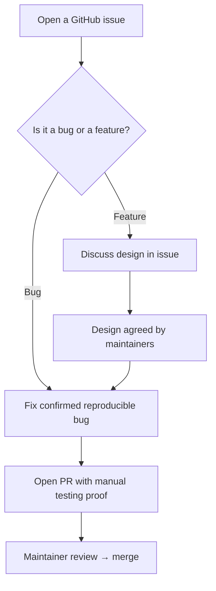

# Contributing to Camael

Thanks for your interest in improving Camael. This project is a fork of [Warp](https://github.com/warpdotdev/Warp) stripped of all telemetry, cloud calls, and external dependencies — built for engineers who work in environments where data cannot leave the machine. Contributions that preserve that guarantee are welcome.

## TL;DR

- Bug fixes can go straight to a PR once the issue is clear and reproducible.
- Feature requests should be discussed in a GitHub issue before any code is written.
- All PRs require proof of manual testing (screenshots or a screen recording).
- Keep the project offline-first — do not introduce network calls, telemetry, or cloud dependencies.

## What This Project Is

Camael is a privacy-first, offline terminal UI for regulated environments (finance, defense, healthcare, government). The core design constraints are:

- **No outbound network requests.** Nothing leaves the machine without the user's explicit, auditable action.
- **No telemetry.** No usage tracking, no crash reporting, no analytics.
- **No cloud dependencies at runtime.** The binary runs fully air-gapped.

Any contribution that introduces or re-introduces network calls, telemetry, or cloud-dependent features will not be merged unless there is an explicit opt-in mechanism and it defaults to off.

## Contribution Flow



## Filing an Issue

Search [existing issues](https://github.com/pancudaniel7/camael/issues) before filing.

### Bug reports

Include:

- A clear title and one-paragraph summary.
- Steps to reproduce, with a minimal example where possible.
- Expected vs. actual behavior.
- Camael version and OS (`Settings → About`).
- Logs or screenshots when relevant.

### Feature requests

Describe the user problem before any implementation idea. Include:

- The need or pain point, and who experiences it.
- Why the current behavior falls short.
- A sketch of the desired behavior.
- Any constraints relevant to air-gapped or regulated environments.

Features that require network access will only be considered if they are strictly opt-in and disabled by default.

## Opening a Pull Request

1. Branch from `main`.
2. Implement the change and add tests where applicable (see [Testing](#testing)).
3. Run `./script/presubmit` and fix any failures before pushing.
4. Open a PR with a clear description of what changed and why.
5. **Include proof of manual testing** — before/after screenshots for visual changes, a screen recording for larger or interactive changes.

Keep PRs focused on a single logical change. Large PRs are harder to review and slower to merge.

## Development Setup

```bash
./script/bootstrap   # platform-specific setup (Rust toolchain, dependencies)
cargo run            # build and run Camael
./script/presubmit   # fmt, clippy, and tests
```

See [README.md](README.md) and [CLAUDE.md](CLAUDE.md) for the full engineering guide.

## Testing

### Manual testing

Required for all changes that affect visible behavior. Include:

- **Before/after screenshots** for small or visual changes.
- **A narrated screen recording** for larger or interactive changes.

### Automated tests

- **Bug fixes** should include a regression test.
- **Non-trivial logic** needs unit tests.
- **User-facing flows** should have integration test coverage under [`crates/integration/`](crates/integration/) where feasible.

Run unit tests with:

```bash
cargo nextest run
```

## Code Style

- `cargo fmt` and `cargo clippy --workspace --all-targets --all-features --tests -- -D warnings` must pass.
- Prefer imports over path qualifiers, inline format args (`println!("{x}")`), and exhaustive `match` over `_` wildcards.
- See [CLAUDE.md](CLAUDE.md) for the full style guide, including UI patterns and terminal model locking rules.

## Commit Conventions

- Branch names: prefix with your handle (`alice/fix-parser`).
- Commit messages: explain *what* and *why*, not just *what*.
- Follow the existing `type(scope): message` format visible in `git log`.

## License Compliance

Camael is dual-licensed under [AGPL v3](LICENSE-AGPL) and [MIT](LICENSE-MIT). Every contribution must comply with both:

- **Do not introduce license-incompatible dependencies.**
- **Preserve copyright headers** in existing files.
- **Do not add network calls or telemetry** — this is both a design constraint and an AGPL source-availability requirement.
- **Document the origin of any copied third-party code** in a comment above the snippet.

See [CLAUDE.md](CLAUDE.md) for the full license compliance rules.

## Code of Conduct

This project follows the [Contributor Covenant](https://www.contributor-covenant.org/) (v2.1). See [`CODE_OF_CONDUCT.md`](CODE_OF_CONDUCT.md) for the full text.

## Reporting Security Issues

See [`SECURITY.md`](SECURITY.md) for the security disclosure policy. **Do not open public issues for security vulnerabilities.**

## Getting Help

- Open a [GitHub issue](https://github.com/pancudaniel7/camael/issues) for bugs or feature requests.
- For questions about the codebase, open a GitHub Discussion or comment on the relevant issue.
