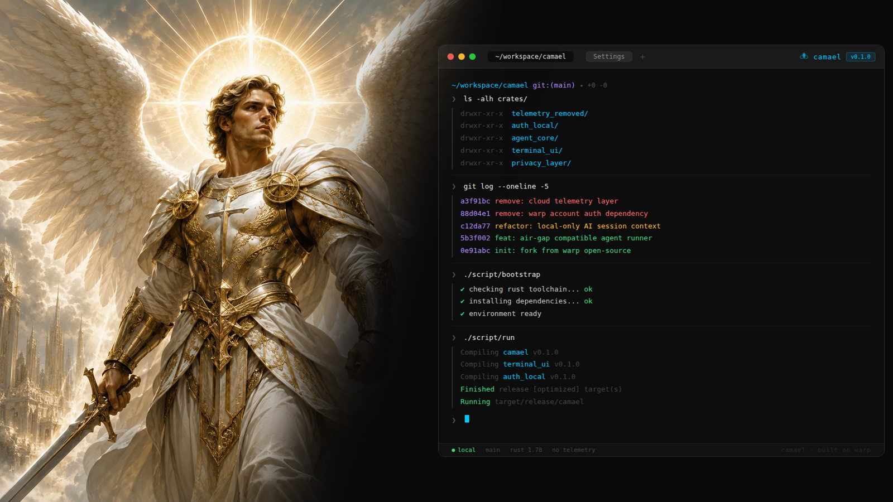

<p align="center">
  
</p>

<br />


# Camael
[](https://github.com/warpdotdev/Warp)
[](LICENSE-AGPL)
[](LICENSE-MIT)

### About

Camael is a fork of [Warp](https://github.com/warpdotdev/Warp), the open-source terminal, modified for engineers who simply can't use the cloud, not because they don't want to, but because their work won't allow it.

If you work in finance, defense, healthcare, or government, you know the situation. Security policies are strict, audits are real, and sending code or context to an external service isn't a gray area, it's a hard no. But most modern developer tools have quietly moved in the opposite direction, baking in telemetry, AI calls, and cloud sync as defaults. That leaves a lot of engineers choosing between productivity and compliance.

Camael doesn't make you choose. It runs entirely on your machine, no telemetry, no outbound requests, nothing leaving your environment without your knowledge. Just a fast, capable terminal UI that respects the rules you have to work under.

### Licensing

Camael's UI framework (the `warpui_core` and `warpui`) are licensed under the [MIT license](LICENSE-MIT).

The rest of the code in this repository is licensed under the [AGPL v3](LICENSE-AGPL).

### Open Source & Contributing

Camael's client codebase is open source and lives in this repository. We welcome community contributions and have designed a lightweight workflow to help new contributors get started. For the full contribution flow, read our [CONTRIBUTING.md](CONTRIBUTING.md) guide.

### Install via Homebrew

The easiest way to install Camael on macOS is via the Homebrew tap:

```bash
brew tap pancudaniel7/camael
brew install --cask camael
```

If macOS blocks the app on first launch with a "damaged" warning, this is because the current app version is an mvp, if users will use this, I will Apple validate this but until then run:

```bash
xattr -cr /Applications/Camael.app
```

To upgrade to the latest version:

```bash
brew upgrade --cask camael
```

### Building the Repo Locally

To build and run Camael from source:

```bash
./script/bootstrap   # platform-specific setup
./script/run         # build and run Camael
./script/presubmit   # fmt, clippy, and tests
```

### Code of Conduct

We ask everyone to be respectful and empathetic. Camael follows the [Code of Conduct](CODE_OF_CONDUCT.md). To report violations, email camael-coc at camael.dev.
