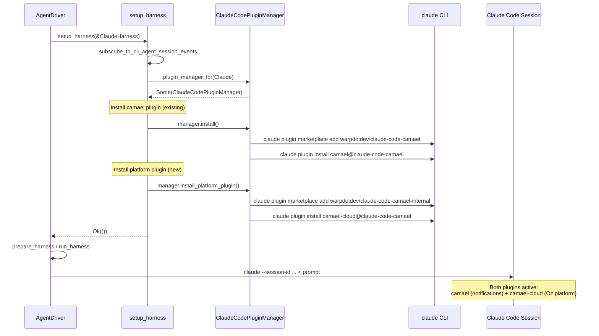

# Tech Spec: Oz Platform Plugin Installation for Third-Party Harnesses

Linear: [REMOTE-1218](https://linear.app/warpdotdev/issue/REMOTE-1218)

## 1. Problem

When a non-Oz harness (e.g. Claude Code) runs via the agent driver, `setup_harness` installs the **Warp notification plugin** (`camael@claude-code-camael` from `warpdotdev/claude-code-camael`). Harness runs also need a separate **Oz platform plugin** (`camael-cloud@claude-code-camael` from `warpdotdev/claude-code-camael-internal`) that connects the third-party CLI to the Oz platform — exposing tools, skills, and hooks (e.g. artifact reporting). This is distinct from the notification plugin: the platform plugin is about Oz integration, not just notifications.

Today, only (a) is installed. We need to also install (b) for all harness runs driven by the agent driver, while keeping (b) out of normal local interactive agent sessions.

## 2. Relevant Code

- `app/src/ai/agent_sdk/driver.rs:1242-1264` — `setup_harness`: subscribes to CLI session events, installs the camael plugin
- `app/src/terminal/cli_agent_sessions/plugin_manager/mod.rs` — `CliAgentPluginManager` trait, `plugin_manager_for()` factory
- `app/src/terminal/cli_agent_sessions/plugin_manager/claude.rs` — `ClaudeCodePluginManager`: install/update via `claude plugin marketplace add` + `claude plugin install`
- `app/src/ai/agent_sdk/driver/harness/mod.rs:29` — `ThirdPartyHarness` trait
- `app/src/ai/agent_sdk/driver/harness/claude_code.rs:83` — `claude_command()` builds the CLI invocation

### External

- `warpdotdev/claude-code-camael-internal` — private repo containing both the existing `camael` plugin and the `camael-cloud` platform plugin
- `.claude-plugin/marketplace.json` — declares `camael-cloud` as a marketplace entry: key `camael-cloud@claude-code-camael`, source `./plugins/camael-cloud`
- `plugins/camael-cloud/skills/oz-report-artifact/` — platform-only skill for reporting PRs back to Oz

## 3. Current State

`setup_harness` does two things:
1. Subscribe to CLI agent session events.
2. Call `plugin_manager_for(harness.cli_agent())` → get a `CliAgentPluginManager` → `manager.install()`.

For Claude, `ClaudeCodePluginManager::install()` runs:
```
claude plugin marketplace add warpdotdev/claude-code-camael
claude plugin install camael@claude-code-camael
```

This installs the **public** `camael` plugin (notifications). There is no concept of a second platform plugin. The `CliAgentPluginManager` trait models a single plugin per CLI agent.

The `claude-code-camael-internal` repo already defines the `camael-cloud` marketplace entry and contains the platform plugin, but nothing in camael-internal installs it.

## 4. Proposed Changes

### 4a. New trait method on `CliAgentPluginManager`

Add an optional platform plugin install method to the existing trait:

```rust
/// Install the Oz platform plugin for this CLI agent, if one exists.
/// Default is a no-op (most agents don't have a platform plugin yet).
async fn install_platform_plugin(&self) -> Result<(), PluginInstallError> {
    Ok(())
}
```

Only `ClaudeCodePluginManager` overrides this. The default no-op means no changes needed for OpenCode or future agents that lack a platform plugin.

We call this `install_platform_plugin` (not `install_cloud_plugin`) because this plugin connects the CLI to the Oz platform — it's not inherently cloud-only. Today we only install it via `setup_harness` (driver-initiated runs), but it could be exposed to local users in the future.

### 4b. `ClaudeCodePluginManager::install_platform_plugin()`

New constants in `claude.rs`:

```rust
const PLATFORM_PLUGIN_KEY: &str = "camael-cloud@claude-code-camael";
const PLATFORM_MARKETPLACE_REPO: &str = "warpdotdev/claude-code-camael-internal";
const PLATFORM_MARKETPLACE_NAME: &str = "claude-code-camael-internal";
```

Implementation: same pattern as `install()`, just targeting the internal repo/key:

```
claude plugin marketplace add warpdotdev/claude-code-camael-internal
claude plugin install camael-cloud@claude-code-camael
```

Note: this repo is **private**. The sandbox environment already has GitHub credentials configured (via `$GITHUB_ACCESS_TOKEN` in `entrypoint.sh`), and the `claude plugin marketplace add` command clones the repo via git, so it should work in cloud environments. For local `agent run --harness claude` runs, the user must have GitHub access to the `warpdotdev` org.

**No version tracking or manual instructions needed.** Unlike the notification plugin (which has `minimum_plugin_version`, `needs_update`, and install/update instruction modals for the footer UI), the platform plugin is only installed programmatically by the driver. There is no user-facing install chip or modal. In cloud environments, containers are ephemeral so every run gets a fresh install. If we later expose this to local users, we'd add version tracking and instructions at that point.

### 4c. `setup_harness`: install platform plugin for non-Oz harness runs

Today's `setup_harness`:
```rust
if let Some(manager) = plugin_manager {
    if let Err(e) = manager.install().await {
        log::warn!("Plugin installation failed (continuing): {e}");
    }
}
```

After:
```rust
if let Some(manager) = plugin_manager {
    if let Err(e) = manager.install().await {
        log::warn!("Plugin installation failed (continuing): {e}");
    }
    if let Err(e) = manager.install_platform_plugin().await {
        log::warn!("Platform plugin installation failed (continuing): {e}");
    }
}
```

Both install calls are best-effort (warn and continue). A failure to install the platform plugin should not block the harness from running — the agent just won't have access to the platform-provided skills.

### 4d. Observability: knowing which skills loaded

The user raised whether it's important to **know** what skills were successfully loaded via the platform plugin. Short answer: not for v1.

Claude Code's plugin system loads skills at session start and makes them available to the agent automatically. There is no callback or event from Claude Code that tells us which plugin skills were actually loaded. The best we can observe is:
- **Install succeeded** (exit code 0 from `claude plugin install`) — the plugin is on disk.
- **Plugin connected** (via the existing `SessionStart` hook/listener) — the plugin is active.

If we need stronger guarantees later (e.g. verifying `oz-report-artifact` is available before dispatching artifact-related tasks), we could:
- Add a `PluginCapabilities` hook in the platform plugin that reports loaded skills at session start.
- Parse the `SessionStart` payload for plugin metadata.

For now, the install-succeeded + plugin-connected signals are sufficient.

## 5. End-to-End Flow



## 6. Risks and Mitigations

**Private repo access.** `warpdotdev/claude-code-camael-internal` is private. Cloud environments have GitHub creds via `$GITHUB_ACCESS_TOKEN`. Local `agent run --harness claude` users need org access. **Mitigation:** `install_platform_plugin` is best-effort; failure is logged, not fatal.

**Plugin name collision.** The `camael` and `camael-cloud` plugins are in different marketplace repos. Claude Code's plugin system keys plugins by `<plugin_name>@<marketplace_name>`, so `camael@claude-code-camael` and `camael-cloud@claude-code-camael` are distinct. No collision risk.

**Install ordering.** We install the notification plugin first, then the platform plugin. If the platform install fails mid-way, the notification plugin is still active. This is the preferred degradation.

**Marketplace caching.** `claude plugin marketplace add` clones the repo. If the internal repo was previously added but is stale, we may need a remove/re-add cycle (like `update()` does for the public plugin). For v1, we do a simple `add` + `install`. If staleness becomes a problem, we can add the remove/re-add dance.

## 7. Testing and Validation

- **Unit test:** `ClaudeCodePluginManager::install_platform_plugin()` constructs the correct commands. Mock `LocalCommandExecutor` and verify the marketplace add + plugin install calls.
- **Unit test:** default `install_platform_plugin()` on `OpenCodePluginManager` returns `Ok(())`.
- **Integration:** run `agent run --harness claude` in a cloud environment, verify both plugins appear in `~/.claude/plugins/installed_plugins.json`.
- **Skill verification:** in a cloud run, verify Claude Code can invoke the `oz-report-artifact` skill (create a test PR, check that the artifact is reported).

## 8. Follow-ups

- **Platform plugin update flow.** The existing `update()` / `needs_update()` only handle the notification plugin. If the platform plugin needs versioned updates, add `update_platform_plugin()` + `platform_plugin_needs_update()`. Not needed for v1 since cloud environments are ephemeral.
- **Skill-loaded verification.** If we need to confirm which skills the platform plugin exposed, add a capabilities hook (see §4d).
- **Other harnesses.** When adding more harnesses with platform plugins, each implements `install_platform_plugin()` in its own `CliAgentPluginManager`.
- **Local interactive sessions.** Currently, `setup_harness` is only called for non-Oz harnesses run via the driver. Normal local agent sessions (the interactive footer flow) use a different path (`agent_input_footer`). So the platform plugin is naturally excluded from local interactive use. If we want to expose it locally in the future, we'd add install/update instructions, and wire it into the footer UI.
